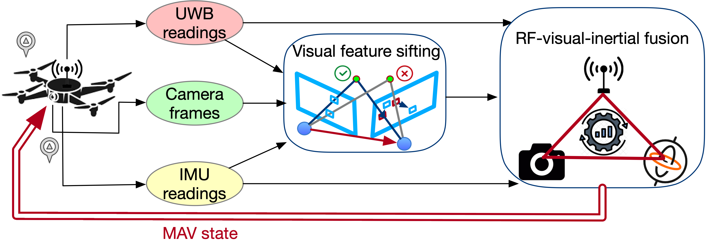
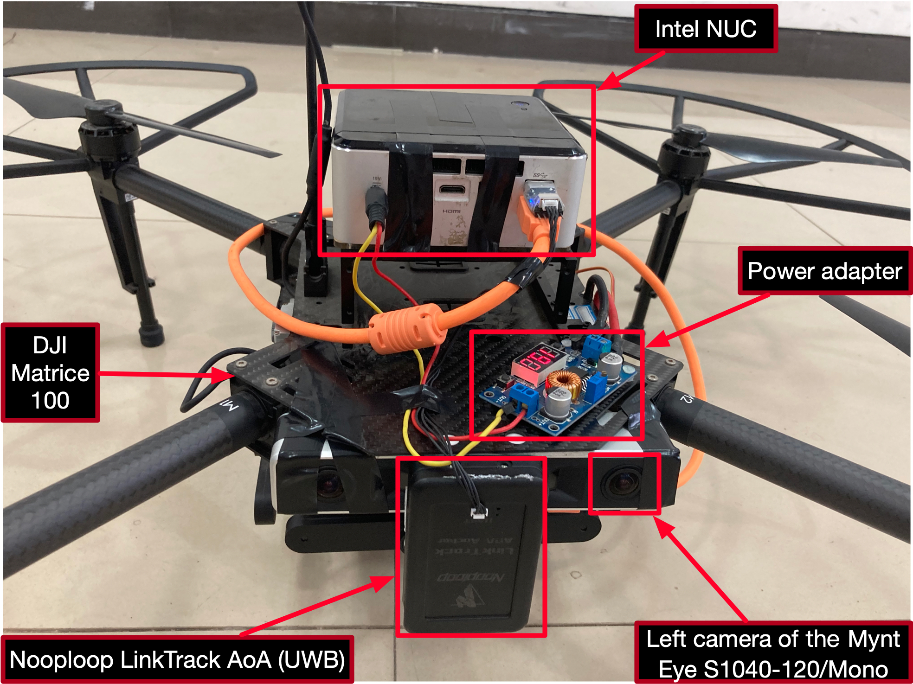
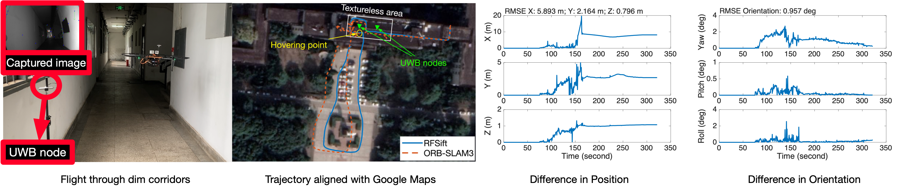

# RFSift
This is the project page for the paper **"Conquering Textureless with RF-referenced Monocular Vision for MAV State Estimation"**.

RFSift is a new state estimator that conquers the textureless challenge with RF-referenced monocular vision. It achieves centimeter-level accuracy in textureless scenes, e.g., dark corridor, white wall, and solid color floor.

This project page contains:
- Overview of our proposed method.
- System implementation and real-world tests.

## The proposed method
Our method consists of two components:
- **RF-sifting** algorithm that sifts best visual features by leveraging 3D UWB measurements.
- **RF-visual-inertial sensor fusion** that achieves robust state estimation by fusing measurements from multiple sensors with contemplinary advantages.

The system overview is illustrated in the following figure.

  

## System implementation and real-world tests
### RFSift prototype
We implement RFSift on an Intel NUC. A [Mynt Eye S 1040-120/mono camera](https://github.com/slightech/MYNT-EYE-S-SDK) and a [Nooploop LinkTrack AoA UWB node](https://www.nooploop.com/en/linktrack-aoa/) are attached to it. An IMU has been integrated into the camera. The NUC is equipped on a DJI M100 platform.

  

### Experiments in a textureless indoor site
In the indoor test site, we deploy one UWB node on the site's edge to assist the navigation. The camera is facing the white wall of the site to ensure the textureless challenge. We compare the performance of RFSift and [ORB-SLAM3](https://github.com/UZ-SLAMLab/ORB_SLAM3) in the following figure.

  

Below is a summary of performance after 10 rounds of flight. It shows that RFSift performs the best in textureless scenes in terms of the root mean square (RMS) of absolute trajectory error (ATE), compared with [ORB-SLAM3](https://github.com/UZ-SLAMLab/ORB_SLAM3) and [VINS-FUSION](https://github.com/HKUST-Aerial-Robotics/VINS-Fusion).

|   | VINS-FUSION | ORB-SLAM3 | RFSift |
| - | ----------- | --------- | ------ |
| P(x) | 70.5 cm | 59.3 cm | 4.8 cm |
| P(y) | 48.9 cm | 41.1 cm | 5.3 cm |
| P(z) | 11.1 cm | 8.7 cm | 4.0 cm |
| Orient. | 2.142&deg; | 1.684&deg; | 0.803&deg; |

### Experiments in a large-scale environment
We test RFSift through our academic building at dusk. The MAV is initialized in a texture-rich landing, then flies through a dim corridor where two UWB nodes are deployed. Finally, it flies out of the building into a texture-rich open area, and flies around a statue without the help of UWB nodes. We align the trajectory with Google Maps and compare the performance of RFSift and ORB-SLAM3.

  

It shows that ORB-SLAM3 works fine in texture-rich areas but drifts in the textureless area from 73 to 164 seconds. During 150 - 160 seconds, the situation worsens because of the hover of the MAV.

## Demo video

